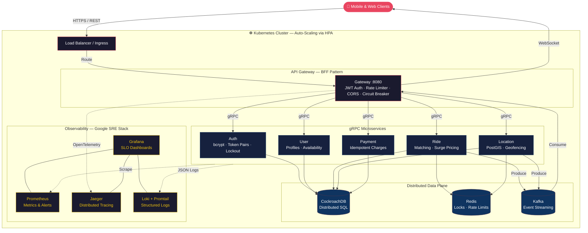

# 🚗 RideShare Platform

Distributed ride-sharing platform engineered for hyperscale. Built with **Go**, **gRPC**, **CockroachDB**, **Kafka**, and **Kubernetes** — following Google SRE and Uber-style microservices patterns.

## Architecture



## Quick Start

```bash
# Deploy full stack to local Kubernetes (Kind)
./scripts/deploy-cluster.sh

# Expose the gateway
kubectl port-forward -n rideshare svc/gateway 8080:8080 &

# Verify
curl http://localhost:8080/health
```

### Service Endpoints

| Service | URL | Notes |
|---------|-----|-------|
| API Gateway | `localhost:8080` | REST + WebSocket |
| Grafana | `localhost:3000` | `admin / rideshare` |
| Jaeger | `localhost:16686` | Trace search |
| Prometheus | `localhost:9090` | PromQL queries |

---

## API Reference

> Full OpenAPI 3.0 spec → [`docs/openapi.yaml`](docs/openapi.yaml)

| Method | Endpoint | Auth | Description |
|--------|----------|:----:|-------------|
| `POST` | `/v1/auth/register` | — | Create rider or driver account |
| `POST` | `/v1/auth/login` | — | Returns access + refresh token pair |
| `POST` | `/v1/auth/refresh` | — | Rotate token pair |
| `POST` | `/v1/rides/request` | 🔒 | Request ride with automatic driver matching |
| `GET` | `/v1/rides/history` | 🔒 | Paginated ride history |
| `GET` | `/v1/rides/:id` | 🔒 | Ride details |
| `POST` | `/v1/rides/:id/accept` | 🔒 | Driver accepts ride |
| `POST` | `/v1/rides/:id/complete` | 🔒 | Driver completes ride |
| `POST` | `/v1/rides/:id/cancel` | 🔒 | Cancel ride |
| `GET` | `/v1/users/:id` | 🔒 | User profile |
| `PUT` | `/v1/users/:id` | 🔒 | Update profile |
| `PUT` | `/v1/users/:id/availability` | 🔒 | Toggle driver online/offline |
| `POST` | `/v1/locations/update` | 🔒 | Push driver GPS coordinates |
| `GET` | `/v1/locations/nearby` | 🔒 | Find nearby drivers (PostGIS) |
| `POST` | `/v1/payments/charge` | 🔒 | Idempotent ride charge |
| `GET` | `/v1/payments/ride/:id` | 🔒 | Payment details |
| `WS` | `/v1/ws?token=<jwt>` | 🔒 | Real-time ride event stream |

---

## Tech Stack & Design Decisions

| Layer | Technology | Why |
|-------|-----------|-----|
| **Language** | Go 1.22 | Low-latency, high-concurrency runtime used at Uber, Google, Cloudflare |
| **API Gateway** | Gin + custom BFF | Backend-for-Frontend pattern — REST ↔ gRPC translation |
| **Inter-service** | gRPC + Protobuf | Type-safe, binary-serialized RPC — 10x faster than JSON/REST |
| **Database** | CockroachDB | Distributed SQL with automatic sharding and multi-region support |
| **Cache / Locks** | Redis | Distributed locks for ride matching, per-user rate limit counters |
| **Event Bus** | Kafka | Async event streaming for ride lifecycle + real-time WebSocket push |
| **Orchestration** | Kubernetes + HPA | Auto-scaling pods based on CPU utilization |
| **Metrics** | Prometheus + Alertmanager | RED metrics, recording rules, multi-window burn-rate alerts |
| **Tracing** | OpenTelemetry → Jaeger | Distributed traces across gateway and all gRPC services |
| **Logging** | zerolog → Loki + Promtail | Structured JSON logs with embedded `trace_id` for correlation |
| **Dashboards** | Grafana | SLO burn-rate gauges, request rate, latency percentiles, HPA scaling curves |
| **Auth** | JWT (access + refresh) | Short-lived tokens, bcrypt hashing, account lockout after 5 failures |

---

## Security

| Feature | Implementation |
|---------|---------------|
| Authentication | JWT access tokens (configurable TTL) + 7-day refresh tokens |
| Password Storage | bcrypt cost factor 10 |
| Brute Force Protection | Account lockout after 5 failed attempts for 15 minutes |
| Rate Limiting | Token-bucket (global) + per-user (100 req/min) |
| Network Policies | Zero-trust Kubernetes NetworkPolicies — deny-all default |
| Request Limits | 1 MB max body size |

---

## Observability

Follows [Google SRE Workbook](https://sre.google/workbook/alerting-on-slos/) patterns.

| Pillar | Stack | Details |
|--------|-------|---------|
| **Metrics** | Prometheus | Recording rules for pre-computed RED metrics, node_exporter for host stats |
| **Traces** | OpenTelemetry → Jaeger | Auto-instrumented HTTP spans via `otelgin`, child spans on `RequestRide`, `matchDriver`, `ChargeRide`. Trace ID in `X-Trace-ID` response header |
| **Logs** | zerolog → Promtail → Loki | Structured JSON, `trace_id` in every line for trace-log correlation |
| **Alerts** | Alertmanager | 🔴 14.4x burn / 1h → page · 🔴 6x burn / 6h → page · 🟡 1x burn / 3d → ticket |
| **Dashboards** | Grafana | *Overview* (RPS, latency, errors, active rides) · *SLOs* (error budget, burn rate gauge) |

---

## Project Structure

```
cmd/
├── gateway/               — API Gateway entrypoint (BFF)
├── auth/                  — Auth gRPC server
├── user/                  — User gRPC server
├── ride/                  — Ride gRPC server
├── location/              — Location gRPC server
└── payment/               — Payment gRPC server

internal/                  — Domain logic per service
├── auth/                  — Registration, login, JWT refresh
├── ride/                  — Matching, surge pricing, lifecycle
├── user/                  — Profiles, driver availability
├── location/              — GPS updates, PostGIS nearby search
├── payment/               — Idempotent charging, Stripe stub
├── notification/          — WebSocket hub, Kafka consumer
└── models/                — Shared domain models

pkg/                       — Reusable platform libraries
├── config/                — Env-based config (Viper)
├── db/                    — CockroachDB connection pool
├── jwt/                   — Token generation + refresh pairs
├── kafka/                 — Producer / consumer wrappers
├── redis/                 — Connection + distributed locks
├── middleware/             — Auth, rate limit, CORS, recovery
├── tracing/               — OpenTelemetry init
├── metrics/               — Prometheus HTTP middleware
└── logger/                — zerolog with trace correlation

proto/                     — Protobuf service definitions
k8s/base/                  — Kubernetes manifests (Kustomize)
monitoring/                — Prometheus, Grafana, Loki, Alertmanager configs
scripts/                   — deploy-cluster.sh, run-loadtest.sh
migrations/                — SQL schema migrations (up/down)
docs/                      — OpenAPI 3.0 spec
Dockerfile                 — Multi-stage build (~15 MB image)
docker-compose.yml         — Local dev stack
```

---

## Load Testing

Distributed k6 load test designed for **1M req/s** inside the Kubernetes cluster.

```bash
# Run distributed load test (50 k6 pods × 20K req/s each)
./scripts/run-loadtest.sh

# Run local smoke test
./scripts/run-loadtest.sh --local
```

| SLO Target | Threshold |
|------------|-----------|
| p95 Latency | < 500 ms |
| p99 Latency | < 1.5 s |
| Error Rate | < 0.1% |

---

## Development

```bash
# Full stack on local Kubernetes (Kind)
./scripts/deploy-cluster.sh

# Port-forward observability
kubectl port-forward -n rideshare svc/grafana 3000:3000 &
kubectl port-forward -n rideshare svc/jaeger 16686:16686 &

# Unit tests
go test ./... -count=1

# Build a single service
go build -o bin/gateway ./cmd/gateway
```

---

## Configuration

| Variable | Default | Description |
|----------|---------|-------------|
| `SERVER_PORT` | `8080` | HTTP / gRPC listen port |
| `DATABASE_URL` | — | CockroachDB connection string |
| `REDIS_ADDR` | `localhost:6379` | Redis address |
| `KAFKA_BROKERS` | `localhost:9092` | Kafka broker list |
| `JWT_SECRET` | — | HMAC signing key |
| `JWT_EXPIRATION` | `24h` | Access token TTL |
| `RATE_LIMIT` | `100` | Global req/s limit |
| `RATE_BURST` | `200` | Burst allowance |
| `OTEL_EXPORTER_OTLP_ENDPOINT` | `localhost:4318` | Jaeger OTLP endpoint |
| `OTEL_ENABLED` | `true` | Toggle distributed tracing |
| `LOG_FORMAT` | `console` | `json` for production |

