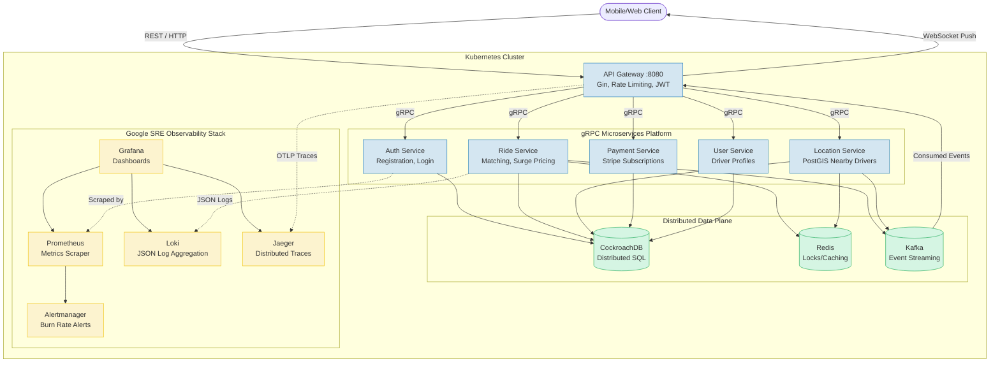

# 🚗 RideShare Platform

Enterprise ride-sharing backend built with Go, PostgreSQL, Redis, and Kafka.

## Architecture



## Quick Start

```bash
# 1. Deploy the entire microservices stack locally to a Kubernetes (Kind) cluster
./scripts/deploy-cluster.sh

# 2. Forward the API Gateway port to your local machine
kubectl port-forward -n rideshare service/gateway 8080:8080 &

# 3. Verify it's running
curl http://localhost:8080/health
```

### Access Points

| Service | URL | Credentials |
|---------|-----|-------------|
| **Gateway API** | http://localhost:8080 | — |
| **Grafana** | http://localhost:3000 | admin / rideshare |
| **Jaeger** | http://localhost:16686 | — |
| **Prometheus** | http://localhost:9090 | — |
| **Alertmanager** | http://localhost:9093 | — |

## API Overview

Full spec: [`docs/openapi.yaml`](docs/openapi.yaml)

### Auth (public)
```
POST /v1/auth/register   — Create account (rider or driver)
POST /v1/auth/login      — Login → access_token + refresh_token
POST /v1/auth/refresh    — Exchange refresh token for new pair
```

### Rides (protected)
```
POST /v1/rides/request        — Request a ride (automatic matching)
GET  /v1/rides/history        — Paginated ride history
GET  /v1/rides/:id            — Ride details
POST /v1/rides/:id/accept     — Driver accepts ride
POST /v1/rides/:id/complete   — Driver completes ride
POST /v1/rides/:id/cancel     — Cancel ride
```

### Users (protected)
```
GET /v1/users/:id              — User profile
PUT /v1/users/:id              — Update profile
PUT /v1/users/:id/availability — Toggle driver availability
```

### Locations (protected)
```
POST /v1/locations/update   — Update driver GPS
GET  /v1/locations/nearby   — Find nearby drivers
```

### Payments (protected)
```
POST /v1/payments/charge       — Charge for ride
GET  /v1/payments/ride/:id     — Payment details
```

### WebSocket
```
GET /v1/ws?token=<jwt>   — Real-time ride events
```

## Security

- **JWT access + refresh tokens** — Short-lived access tokens (configurable), 7-day refresh tokens
- **Account lockout** — 5 failed login attempts → 15 minute lockout
- **Per-user rate limiting** — 100 requests/minute per authenticated user
- **Global rate limiting** — Configurable token-bucket limiter
- **bcrypt password hashing** — Cost factor 10
- **Request body size limit** — 1MB max

## Observability (Google SRE Stack)

### Metrics
- Prometheus with recording rules (pre-computed RED metrics)
- node_exporter for host metrics
- Custom business metrics (rides, payments, surge)

### Tracing
- OpenTelemetry SDK with OTLP export to Jaeger
- Automatic HTTP span creation via `otelgin` middleware
- Child spans on `RequestRide`, `matchDriver`, `ChargeRide`
- Trace ID in all response headers (`X-Trace-ID`)

### Logging
- Structured JSON logs (zerolog)
- `trace_id` in every log line for correlation
- Shipped to Loki via Promtail

### Alerting
- **Multi-window burn-rate** alerts (Google SRE Workbook Ch. 5)
  - 🔴 Fast: 14.4x burn over 1h → page
  - 🔴 Medium: 6x burn over 6h → page
  - 🟡 Slow: 1x burn over 3d → ticket
- Infrastructure alerts (disk, CPU, memory, target health)
- Alertmanager routing: critical → PagerDuty, warning → Slack

### Dashboards
- **RideShare — Overview**: request rate, latency, error rate, active rides
- **RideShare — SLOs**: error budget gauge, latency SLO, burn rate

## Project Structure

```
├── cmd/gateway/          — Application entry point
├── internal/
│   ├── auth/             — Registration, login, JWT refresh
│   ├── ride/             — Ride lifecycle, matching, surge pricing
│   ├── user/             — Profile management, driver availability
│   ├── location/         — GPS updates, PostGIS nearby search
│   ├── payment/          — Stripe stub, idempotent charging
│   ├── notification/     — WebSocket hub, Kafka consumer
│   └── models/           — Domain models (User, Ride, Payment, etc.)
├── pkg/
│   ├── config/           — Environment-based configuration
│   ├── db/               — PostgreSQL connection + transactions
│   ├── errors/           — Structured error codes (AppError)
│   ├── geo/              — Haversine, fare estimation, ETA
│   ├── jwt/              — Token generation + refresh token pairs
│   ├── kafka/            — Producer/consumer wrappers
│   ├── logger/           — Structured JSON logging with trace correlation
│   ├── metrics/          — Prometheus HTTP middleware
│   ├── middleware/        — Auth, rate limit, CORS, recovery, trace ID
│   ├── pagination/       — Cursor/offset pagination
│   ├── redis/            — Connection + distributed locks
│   ├── security/         — Account lockout, per-user rate limiting
│   └── tracing/          — OpenTelemetry initialization
├── migrations/           — SQL schema migrations (up/down)
├── monitoring/
│   ├── alertmanager/     — Alert routing config
│   ├── grafana/          — Dashboards + datasource provisioning
│   ├── loki/             — Log aggregation config
│   ├── prometheus/       — Scrape config + alerting/recording rules
│   └── promtail/         — Log shipping config
├── scripts/
│   ├── loadtest.js       — k6 load test (smoke/load/spike)
│   └── init-db.sh        — Auto-run migrations on Docker boot
├── docs/
│   └── openapi.yaml      — OpenAPI 3.0 spec
├── Dockerfile            — Multi-stage build (~15MB image)
├── docker-compose.yml    — Full stack (11 services)
└── go.mod
```

## Load Testing

```bash
# Install k6
brew install k6

# Run load test (gateway must be running)
k6 run scripts/loadtest.js

# Custom parameters
k6 run scripts/loadtest.js --vus 100 --duration 5m
```

SLO thresholds: p95 < 500ms, p99 < 1.5s, error rate < 5%.

## Development

We use a local Kubernetes cluster (Kind) to replicate production locally.

```bash
# Deploy the cluster and all microservices
./scripts/deploy-cluster.sh

# Forward ports to access observability stack locally
kubectl port-forward -n rideshare service/grafana 3000:3000 &
kubectl port-forward -n rideshare service/jaeger 16686:16686 &
kubectl port-forward -n rideshare service/prometheus 9090:9090 &

# Run distributed k6 load test (1M req/s simulation inside the cluster)
./scripts/run-loadtest.sh

# Run load test locally (from your laptop)
./scripts/run-loadtest.sh --local

# Run unit tests
go test ./... -count=1
```

## Configuration

| Variable | Default | Description |
|----------|---------|-------------|
| `SERVER_PORT` | 8080 | HTTP or gRPC listen port |
| `DATABASE_URL` | — | CockroachDB connection string |
| `REDIS_ADDR` | localhost:6379 | Redis address |
| `KAFKA_BROKERS` | localhost:9092 | Kafka broker addresses |
| `JWT_SECRET` | — | JWT signing secret |
| `JWT_EXPIRATION` | 24h | Access token TTL |
| `RATE_LIMIT` | 100 | Global requests/second |
| `RATE_BURST` | 200 | Global rate limit burst |
| `OTEL_EXPORTER_OTLP_ENDPOINT` | localhost:4318 | Jaeger OTLP endpoint |
| `OTEL_ENABLED` | true | Enable/disable tracing |
| `LOG_FORMAT` | console | `json` for structured output |
